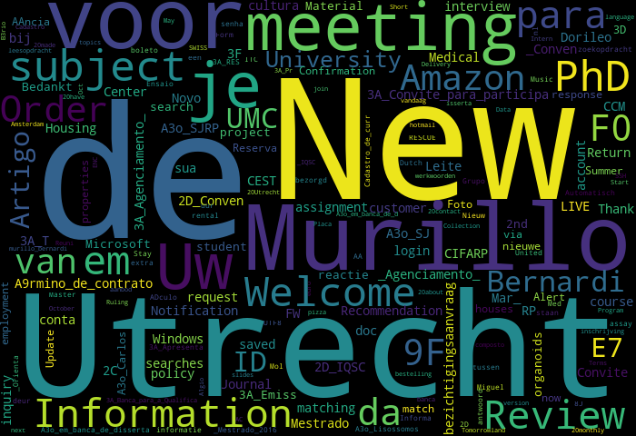

# EDA with personal email

In this project I downloaded my emails and performed an EDA.

### Getting your emails
1. Log in to your personal Gmail account
2. Go to the following link: <a href='https://takeout.google.com/settings/takeout'>https://takeout.google.com/settings/takeout</a>
3. Deselect all the items but Gmail
4. Select the archive format (you can select to export once or set a date to update)

I selected Send download link by email, One-time archive, .zip, and the maximum allowed size. 

You can customize the format. Once done, hit <strong>Create archive.</strong>

You will get an email when the archive is ready for downloading. 

#### Loading the data

You will need to <strong><em>import mailbox</em></strong> and <strong><em>csv</em></strong> to read the data.

##### You can check the code on my Notebook.

## Takeaways

With this simple analysis we can take a few information about our mailbox:

* How many emails we received and sent in the past years;
* With whom you interacted most;
* The most active time, which in this case was on Thursdays and Wednesdays, between 12-15h;
* Most used words in the subject.

You can go further and also analyze the email text body, create sentiment analysis, identify unwanted emails, and so on.

In my case, I didn't have many emails stored anymore. But it was a nice project to learn how to get the content from my email and explore it. 
   
   

<strong>Most Used Words</strong>
  

  

   
 

